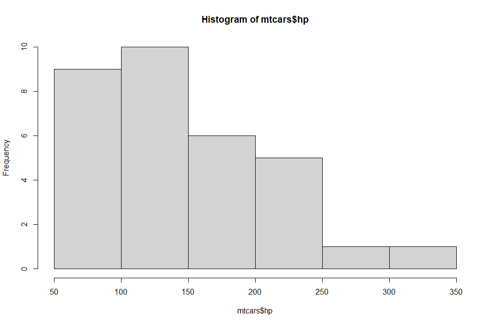

# PCA and Linear Regression Analysis on the `mtcars` Dataset

## Project Overview

This project explores the `mtcars` dataset through a comprehensive workflow involving data exploration, Principal Components Analysis (PCA), and linear regression modeling. It highlights advanced data preprocessing, visualization, and predictive modeling techniques, emphasizing practical applications in data science and analytics.

---

## Features

### 1. **Data Exploration**
- **Dataset Insights**:
  - Loaded the `mtcars` dataset from a CSV file.
  - Inspected its structure, summarized key statistics, and visualized data distributions.
  - Tasks included quantile and variance analysis for specific variables like `wt` (weight).

### 2. **Principal Components Analysis (PCA)**
- **Dimensionality Reduction**:
  - Applied PCA using a correlation matrix to identify relationships among variables.
  - Determined key variables strongly associated with `mpg` (mileage), such as `wt` and `hp`.

### 3. **Predictive Modeling**
- **Linear Regression**:
  - Built a regression model to predict mileage (`mpg`) based on other features in the dataset.
  - Evaluated the model's performance using summary statistics.

### 4. **Exploratory Insights**
- Identified specific subsets of vehicles:
  - Sports cars with high horsepower (`hp > 200`) and low weight (`wt < 3`).
  - Cars offering good mileage (`mpg > 20`).
- Analyzed relationships between car features to make data-driven recommendations.

---

## Key Tasks and Outcomes

1. **Data Exploration**:
   - Reviewed the dataset structure, variable names, and summary statistics.
   - Generated visualizations, including histograms for horsepower (`hp`).

   

2. **Principal Components Analysis (PCA)**:
   - Reduced dimensionality to understand variable contributions.
   - Identified key variables influencing mileage, highlighting `wt` and `hp`.

3. **Regression Modeling**:
   - Developed a linear regression model to predict `mpg`.
   - Evaluated model accuracy and identified significant predictors.

4. **Custom Analysis**:
   - Defined and scaled characteristics of a hypothetical car to analyze its performance using PCA.
   - Checked compatibility of matrices for PCA transformations and performed matrix multiplication.

---

## Project Artifacts

### Screenshots
- **Histogram of Horsepower**:
  

- **PCA Loadings**:
  

### Files
- `mtcars.csv`: Dataset used for analysis.
- `JeremiahOchepo_Assignment7_analysis_code.R`: Complete R code for the project.

---

## Usage Instructions

### Requirements
- **Software**: R or RStudio installed on your system.
- **Packages**: Ensure the `tidyverse` package is installed.

### Steps
1. Clone this repository:
   ```bash
   git clone https://github.com/your-username/mtcars-pca-regression.git
   cd mtcars-pca-regression
   ```

2. Open the R script:
   ```bash
   Rscript JeremiahOchepo_Assignment7_analysis_code.R
   ```

3. View the analysis and visualizations generated during the execution.

---

## Contact Information

**Author**: Jeremiah Ochepo  
**Email**: [jochepo4growth@gmail.com](mailto:jochepo4growth@gmail.com)  
**GitHub Repository**: [mtcars PCA and Regression Analysis](https://github.com/your-username/mtcars-pca-regression)  